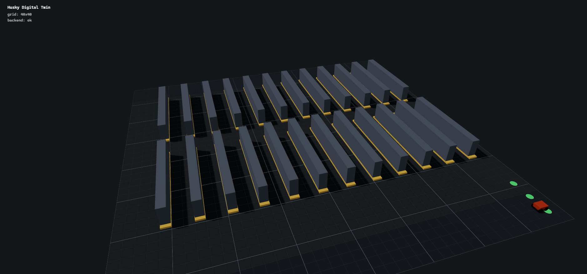
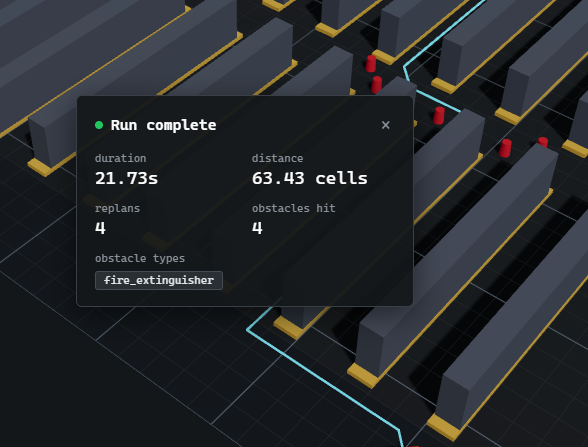

# Husky Digital Twin

A single-robot, browser-native 3D digital twin of a warehouse Husky — real-time
tracking, multi-stop routes, live obstacle replanning, a configurable
warehouse layout editor, persistent run history with a metrics dashboard, and
an onboard robot camera feed. No ROS, no physics simulator: a deterministic
Python tick loop synced live to a React Three Fiber scene over WebSocket.

Inspired by [WareTwin](https://github.com/WayneChou-bot/WareTwin).

**Live demo:** https://husky-twin.vercel.app

> The backend runs on Render's free tier, kept warm by a scheduled GitHub
> Action pinging `/health` every 14 minutes. If it's ever gone unusually
> quiet, the first load may take a few extra seconds while it wakes up. Run
> history also resets on every backend deploy/restart — see
> [Deployment](#deployment).




## What it does

- **Environment**: a 40×40 warehouse grid by default — dense racking (posts,
  shelf decks, stocked cartons) split into two zones by a cross-aisle, an open
  staging area with chargers up front, an open back area behind the racking.
  Fully editable — see **Layout editor** below.
- **Pathfinding**: 8-directional A*, corner-cut-safe, replans live around
  obstacles.
- **Obstacles**: click the floor to drop a **pallet** (static, blocks the
  path) or a **person** (blocks the path *and* wanders one cell at a time on
  its own) — either one on the robot's current path triggers a live replan.
- **Task queue**: queue up multiple stops in order (a pick run, not just
  point-to-point) via the **Route** panel — the robot visits them in
  sequence, and the run report breaks down distance/duration/replans per
  stop.
- **Layout editor**: a 2D top-down grid editor to paint shelves and chargers
  and set the start/target cell, save named layouts, and hot-swap the *live*
  running simulation onto one — no redeploy needed.
- **Persistence**: every run is stored (SQLite) with a full history — see it
  in the **Metrics** panel, or over REST (`GET /runs`, `GET /runs/stats`).
- **Metrics dashboard**: an always-visible side panel — total/average
  stats, completed-vs-stopped, a runs-per-day chart, an obstacles-by-type
  chart, and a recent-runs table. Click any past run to reopen its full
  report.
- **Robot Cam**: a second, independent 3D view riding the robot — an
  always-streaming onboard/CCTV-style feed, separate from the main
  interactive view so it never gets in the way of placing obstacles or
  planning a route.
- **Live sync**: WebSocket connection between backend and browser; robot
  position, heading, path, and obstacle positions update every ~100ms tick.
- **Report**: pops up when a run finishes — duration, distance traveled,
  replans triggered, obstacles hit, which obstacle types were involved, and
  a per-stop breakdown for multi-stop runs.

## Stack

**Backend** — FastAPI, Pydantic, `websockets`, a hand-rolled A* pathfinder,
SQLite (stdlib `sqlite3`, no ORM) for run history and saved layouts. No ROS,
no simulator — just a deterministic asyncio tick loop driving a small state
machine (`idle → navigating → replanning → arrived`).

**Frontend** — React, TypeScript, React Three Fiber (Three.js) + drei,
zustand, Vite. No chart library — the metrics dashboard's bar charts are
hand-rolled SVG.

## Architecture

```
backend/
  app/
    schema.py         Pydantic models — single source of truth for the WS wire format
    db.py               SQLite persistence — runs table + saved layouts table
    layout/              warehouse layout (generator script + generated JSON)
    sim/
      pathfinding.py     A*
      engine.py            state machine + tick loop + task queue + obstacle behavior
    main.py                 FastAPI app — WebSocket endpoint + REST (/runs, /layouts)
frontend/
  src/
    scene/              React Three Fiber components — Warehouse, RackUnit, HuskyRobot,
                          PathLine, ObstacleMarkers, TargetMarkers, RobotPovCamera
    store/               zustand store, updated by the WS client
    ws/                   WebSocket client
    api/                   REST clients (runs, layouts) — plain fetch, no library
    components/             ReportPanel, LayoutEditor, MetricsSidePanel, RobotCamPanel, TopBar
    schema/                  TS mirror of the backend schema (kept in sync by hand)
```

`backend/app/schema.py` and `frontend/src/schema/types.ts` mirror each other
by hand — no codegen. Update both when the schema changes.

### REST API

Alongside the `/ws` WebSocket (the primary live channel), the backend
exposes:

| Route | What it does |
|---|---|
| `GET /health` | liveness check |
| `GET /runs?limit=50` | run history, newest first |
| `GET /runs/stats` | aggregate stats for the metrics dashboard |
| `GET /runs/{run_id}` | a single stored run report |
| `GET /layouts` | saved layout summaries |
| `GET /layouts/starter` | a freshly generated layout, to seed the editor |
| `GET /layouts/{id}` | a saved layout's full data |
| `POST /layouts` | save a new layout |
| `POST /layouts/{id}/activate` | hot-swap the running sim onto a saved layout |

## Running locally

**Backend**
```bash
cd backend
python3 -m venv venv
source venv/bin/activate      # Windows: venv\Scripts\activate
pip install -r requirements.txt
uvicorn app.main:app --reload --port 8000
```
Check it's alive: `curl http://localhost:8000/health` → `{"status": "ok"}`

**Frontend**
```bash
cd frontend
npm install
npm run dev
```
Open http://localhost:5173 — click **Start Run** and the Husky should move.

## Deployment

- **Backend** → Render, deployed via the `render.yaml` Blueprint at the repo
  root. Python version is pinned to 3.12 (Render's newer default Python
  versions don't have prebuilt wheels for every pinned dependency, which
  forces a from-source build that fails in Render's sandbox). CORS origins
  are read from the `FRONTEND_ORIGINS` env var — **set it in the Render
  dashboard's Environment tab** to your Vercel URL (e.g.
  `https://husky-twin.vercel.app`); it's declared `sync: false` in
  `render.yaml` on purpose so a Blueprint redeploy doesn't silently wipe it
  back to empty and break every REST call (`/runs`, `/layouts`, …) from the
  deployed frontend — the WebSocket itself isn't gated by CORS, so that part
  still "works" even if this is misconfigured, which is a deceptively easy
  way to miss it.
- **Run history & saved layouts** live in SQLite at
  `backend/app/data/runs.db`. Render's free-tier filesystem is ephemeral, so
  this resets on every deploy/restart — see `render.yaml` for the upgrade
  path (a paid persistent disk, or pointing `HUSKY_DB_PATH` at an external
  Postgres instead) if that history needs to survive restarts.
- **Frontend** → Vercel, with the project root directory set to `frontend/`
  (required in a monorepo) and `VITE_WS_URL` set to the deployed backend's
  `wss://` URL. The REST API base is derived from this same variable (no
  separate `VITE_API_URL` needed) — see `frontend/src/api/base.ts`.
- **Keep-alive** → `.github/workflows/keep-alive.yml` pings the backend
  every 14 minutes using the `RENDER_BACKEND_URL` repo secret, so Render's
  free tier never sees 15 minutes of inactivity and never spins down.
